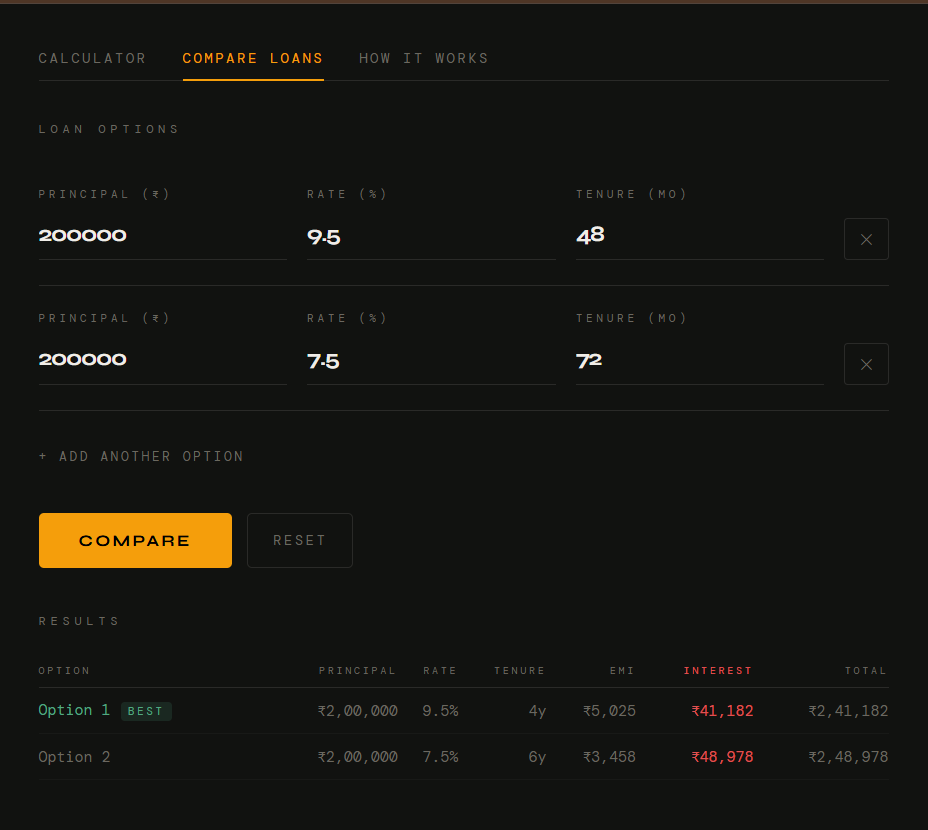

# EMI Wizard
### Series 8 - Project 8b

A loan EMI calculator that goes beyond the number. Most calculators tell you your monthly payment and stop there. This one shows the full picture, every rupee of interest, month by month, so you understand what borrowing actually costs.

<br>

<a href="https://viditsinghal2406-dotcom.github.io/s8a_sudoku_engine">
  
</a>

<br>

**[Play Live](https://viditsinghal2406-dotcom.github.io/s8b_emi_wizard)**

---

## Features

- Monthly EMI using the standard reducing-balance formula
- Full amortization schedule, month by month
- Total interest paid and cost factor
- Principal vs interest breakdown bar
- Compare multiple loan options side by side, best option highlighted
- Export full schedule to CSV

---

## Usage

**Web:** Open the live link above, no setup needed.

**CLI:**
```bash
python emi.py
python emi.py --principal 1000000 --rate 9.0 --tenure 240
python emi.py --principal 500000 --rate 8.5 --tenure 60 --all --export
python emi.py --compare
```

---

## Arguments

| Argument | Description |
|---|---|
| `--principal` | Loan amount in rupees |
| `--rate` | Annual interest rate |
| `--tenure` | Loan tenure in months |
| `--export` | Export schedule to CSV |
| `--all` | Show every month in the schedule |
| `--compare` | Compare multiple loan scenarios |

---

## How It Works

**EMI Formula, Reducing Balance:**
```
EMI = P x r x (1 + r)^n / ((1 + r)^n - 1)

P = Principal
r = Monthly rate (annual rate / 12 / 100)
n = Tenure in months
```

Each month, interest is calculated on the remaining balance, not the original principal. As you repay, less goes to interest and more to principal. The schedule makes this shift visible.

---

## No Dependencies

Pure Python standard library, no pip installs needed.

---

## Part of Series 8, CORE
22 pure Python projects covering games, finance tools, and utilities.

---

*Built by Vidit Singhal*
